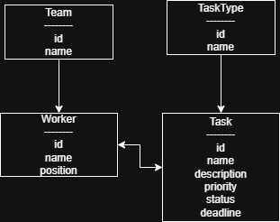

# 🚀 DevFlow

DevFlow is a web application built with Django for managing software development workflows and IT teams.

The platform enables project managers and team members to organize tasks, manage teams, assign workers, and track project progress through a simple and intuitive interface.

---

# ✨ Features

## Task Management

* Create tasks
* View task details
* Update tasks
* Delete tasks
* Set priorities
* Track task status
* Manage deadlines
* Assign workers to tasks

## Team Management

* Create teams
* Update teams
* Delete teams
* Assign workers to teams
* Manage team members

## Task Classification

* Create task types
* Update task types
* Delete task types
* Organize tasks by category

## Authentication

* User login/logout
* Protected views
* User-specific access control

## Administration

* Django Admin Panel
* Bootstrap-based interface
* Responsive design

---

# 🛠 Technologies Used

* Python 3
* Django
* SQLite
* Bootstrap 5
* HTML5
* CSS3

---

# 🗄 Database Structure

The application is composed of four main entities:

* Team
* Worker
* TaskType
* Task

## Entity Relationship Diagram (ERD)



## Relationships

* One Team can contain multiple Workers
* One Worker can belong to multiple Teams
* One TaskType can be associated with multiple Tasks
* One Task can be assigned to multiple Workers

---

# 📸 Application Screenshots

## Home Page


## Task List


## Task Details


## Create Task


## Update Task


## Delete Task


## Django Admin Panel


---

# ⚙ Installation

## Clone the repository

```bash
git clone https://github.com/nascimento140594/dev-flow.git
```

## Navigate to the project directory

```bash
cd dev-flow
```

## Create a virtual environment

```bash
python -m venv .venv
```

## Activate the virtual environment

### Windows

```bash
.venv\Scripts\activate
```

### Linux/macOS

```bash
source .venv/bin/activate
```

## Install dependencies

```bash
pip install -r requirements.txt
```

## Apply migrations

```bash
python manage.py migrate
```

## Create a superuser (optional)

```bash
python manage.py createsuperuser
```

## Run the development server

```bash
python manage.py runserver
```

Open in your browser:

```text
http://127.0.0.1:8000/
```

---

# 📂 Project Structure

```text
dev-flow/
│
├── config/
├── tasks/
├── templates/
├── screenshots/
│
├── README.md
├── database-diagram.png
├── requirements.txt
└── manage.py
```

---

# 🔑 Main Functionalities

* Manage software development tasks
* Manage teams and workers
* Assign workers to teams
* Assign workers to tasks
* Organize tasks by task type
* Track task priorities and deadlines
* Use Django Admin for advanced management

---

# 👨‍💻 Author

Matheus Araujo Nascimento

GitHub: https://github.com/nascimento140594

---

# 📌 Portfolio Project

This project was developed as part of a Django Portfolio Project and demonstrates:

* Django Models
* Generic Class-Based Views
* CRUD Operations
* Django Templates
* Bootstrap Integration
* Database Modeling
* Authentication System
* Git & GitHub Workflow
* Project Documentation
* Relational Database Design
